Coca Cola Earnings
================
Vikas Agarwal, Camille Blain-Collier, Giulio De Felice, Nayla Fakhoury, Alejandro Koury, Federico Loguercio, Victor Vu
2/23/2019

### Time series analysis of coca cola quarterly earnings using a multiplicative SARIMA model

    ## Loading required package: timeDate

    ## Loading required package: timeSeries

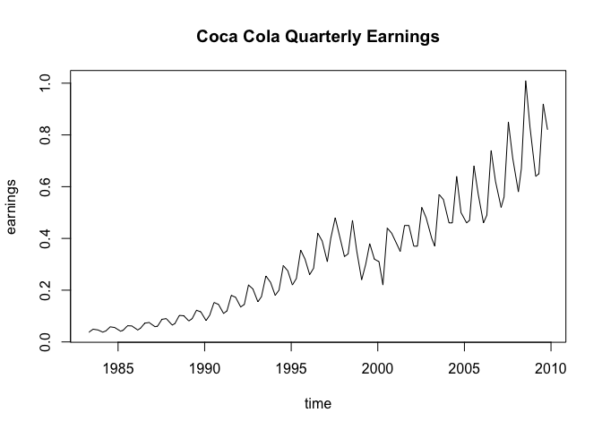

A clear yearly trend can be detected.


The sinusodial shape of the autocorrelation function is a strong indication for a seasonal trend underlying the data, with a high number of lags out of limits.

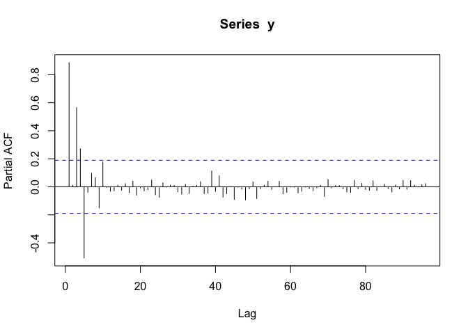

Plotting the PACF is extremely informative. Four lags out of order can be identified, 1, 3, 4 and 5. Interestingly, lag four is only on the brink. However, the ACF clearly indicated the existence of a seasonal (yearly) trend.The explanation to this lies in the combination of a seasonal and non-seasonal trend. Their combination leads to partial autocorrelations of order 3 and 5.

Formally test the need for differences Must seasonal differences be taken?

``` r
s=4
nsdiffs(y, m = s, test = c("ocsb"))  # seasonal differences?
```

    ## Warning: argument m is deprecated; please set the frequency in the ts
    ## object.

    ## [1] 1

The formal test suggests that one seasonal difference needs to be taken.

Normal differences?

``` r
ndiffs(y, alpha=0.05, test=c("adf")) # regular differences?
```

    ## [1] 1

One normal difference must be taken.

We will first take that suggested seasonal difference and then analyse the remaining structure in the data.

``` r
fit1 <- arima(y,order=c(0,0,0),seasonal=list(order=c(0,1,0),period=s)) 
fit1
```

    ## 
    ## Call:
    ## arima(x = y, order = c(0, 0, 0), seasonal = list(order = c(0, 1, 0), period = s))
    ## 
    ## 
    ## sigma^2 estimated as 0.002701:  log likelihood = 158.42,  aic = -314.85

``` r
plot(fit1$residuals)
```

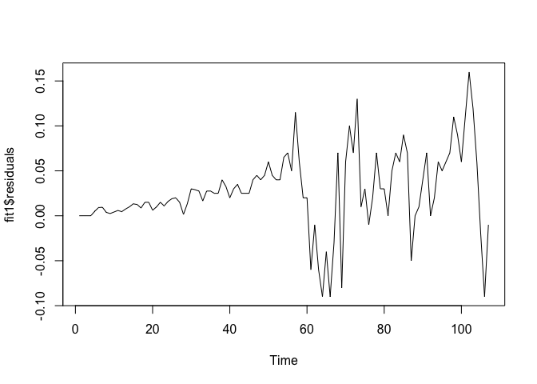

The data does not look stationary, variance appears to be increasing significantly as time proceeds.

### Procedure:

We will first proceed to estimate a model with this data and then compare the estimation performance with a model fit to the logarithmised data.

Let's analyse the residuals in terms of autocorrelation:

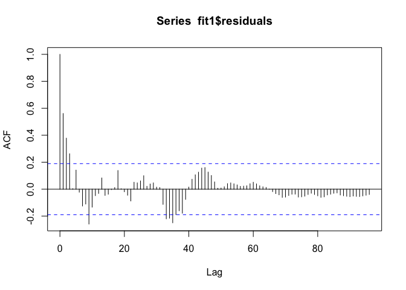

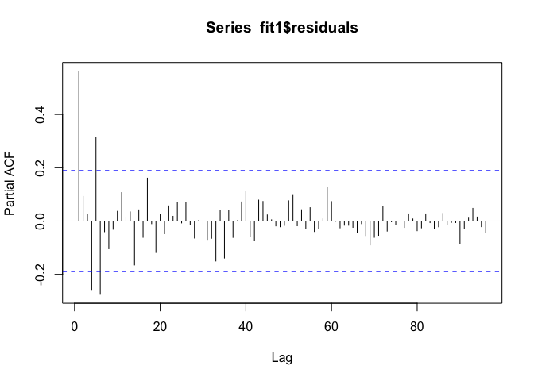

Considerable structure can still be seen in the data. First looking at the multiples of the seasonal parameter, 4, the first lag (lag 4) in the PACF is out of limits, warranting an AR(1) term in the seasonal part. The structure in the ACF is unclear, there are no lags clearly indicating that an MA term should be added. Next, observing the small lags (below 4), lag 1 in the PACF is out of limits. The lags which are not multiples of 4 but bigger than 4 may be taken care of by the multiplicative effects of seasonal and non-seasonal AR-terms; we will not attempt to fit them yet.

The residuals seem stationary in the mean, which is confirmed formally:

``` r
ndiffs(fit1$residuals)
```

    ## [1] 0

No regular differences are suggested by the formal test anymore.

We will proceed by fitting a SARIMA model with both a seasonal and regular AR(1) term, with 1 seasonal difference.

``` r
fit2 <- arima(y,order=c(1,0,0),seasonal=list(order=c(1,1,0),period=s)) 
print(fit2)
```

    ## 
    ## Call:
    ## arima(x = y, order = c(1, 0, 0), seasonal = list(order = c(1, 1, 0), period = s))
    ## 
    ## Coefficients:
    ##          ar1     sar1
    ##       0.8255  -0.4360
    ## s.e.  0.0576   0.0972
    ## 
    ## sigma^2 estimated as 0.001214:  log likelihood = 198.8,  aic = -391.6

``` r
plot(fit2$residuals)
```

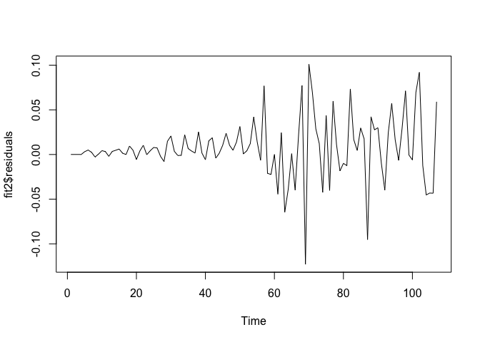

All estimated coefficients are highly significant.

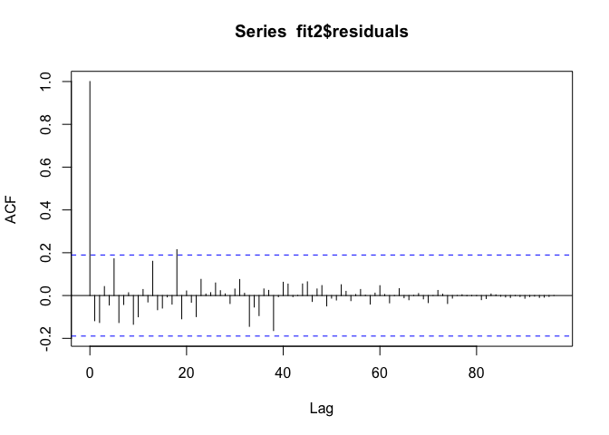 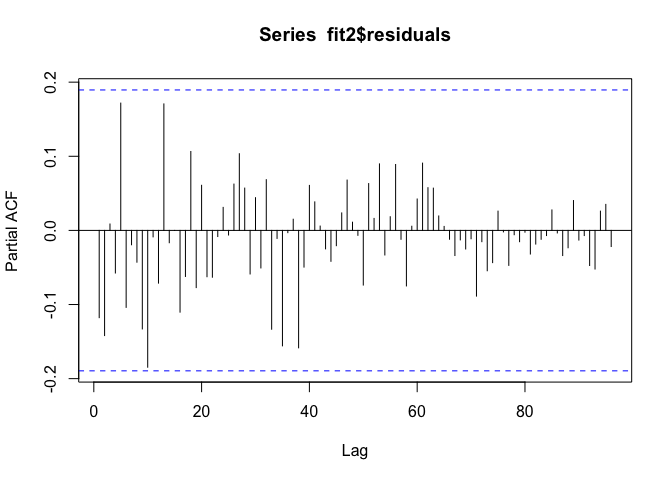

While the residuals still do not look stationary in the variance, no remaining autocorrelation can be identified in the ACF and the PACF. The Box-Pierce test formally confirms this.

``` r
Box.test(fit2$residuals, lag = 24)
```

    ## 
    ##  Box-Pierce test
    ## 
    ## data:  fit2$residuals
    ## X-squared = 23.596, df = 24, p-value = 0.4849

### Proceed to estimating the logarithmized Time Series

``` r
z = log(y)
ts.plot(z)
```

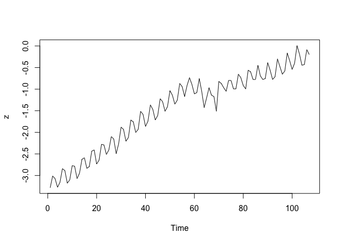

Based on the plot, the logarithmised time series appears to have constant variance across time, in absolute values.

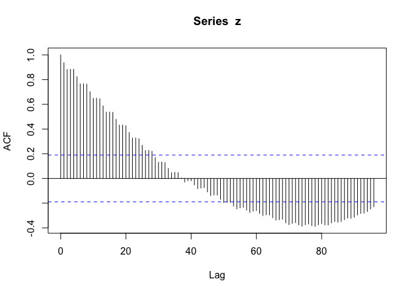

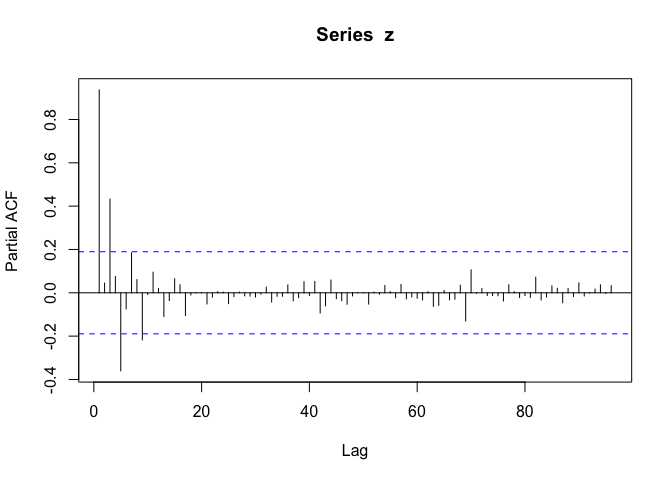

``` r
s=4
nsdiffs(z, m = s, test = c("ocsb"))  # seasonal differences?
```

    ## Warning: argument m is deprecated; please set the frequency in the ts
    ## object.

    ## [1] 1

``` r
ndiffs(z, alpha=0.05, test=c("adf")) # regular differences?
```

    ## [1] 1

The analysis up to this point is comparable with the non-transformed data; both a seasonal and a regular difference are formally suggested.

``` r
fit_log_1 <- arima(z,order=c(0,0,0),seasonal=list(order=c(0,1,0),period=s)) 
fit_log_1
```

    ## 
    ## Call:
    ## arima(x = z, order = c(0, 0, 0), seasonal = list(order = c(0, 1, 0), period = s))
    ## 
    ## 
    ## sigma^2 estimated as 0.02653:  log likelihood = 40.77,  aic = -79.53

``` r
plot(fit_log_1$residuals)
```

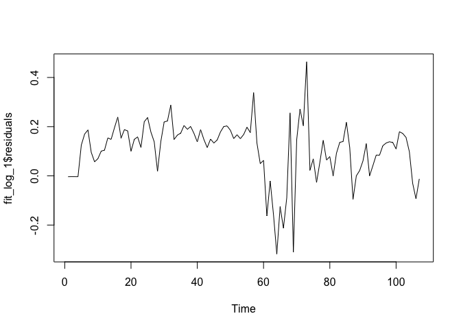

After taking a seasonal difference, the residuals seem fairly stationary in both mean and variance, apart from one turbulent period, which also leads to slightly higher mean for the remaining time.

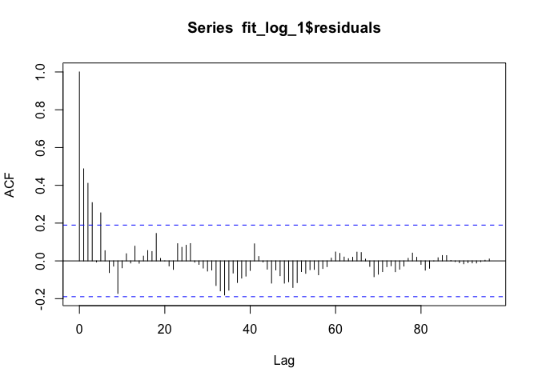

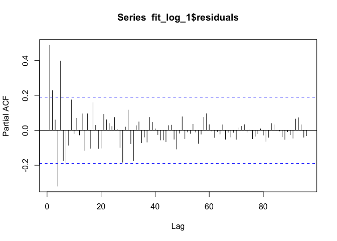

``` r
ndiffs(fit_log_1$residuals, alpha=0.05, test=c("adf")) 
```

    ## [1] 0

``` r
Box.test(fit_log_1$residuals,lag=16)
```

    ## 
    ##  Box-Pierce test
    ## 
    ## data:  fit_log_1$residuals
    ## X-squared = 65.893, df = 16, p-value = 5.168e-08

Again, lag 4 out of limits in the PACF suggests an AR(1) term in the seasonal part. Looking at the smaller lags, 1 is clearly out of limits and 2 is on the edge. Regular differences are no longer necessary according to the formal test.

We proceed by including the lags specified above.

``` r
fit_log_2 <- arima(z,order=c(2,0,0),seasonal=list(order=c(1,1,0),period=s)) 
fit_log_2
```

    ## 
    ## Call:
    ## arima(x = z, order = c(2, 0, 0), seasonal = list(order = c(1, 1, 0), period = s))
    ## 
    ## Coefficients:
    ##          ar1     ar2     sar1
    ##       0.6366  0.2757  -0.4743
    ## s.e.  0.0991  0.0972   0.0907
    ## 
    ## sigma^2 estimated as 0.008758:  log likelihood = 96.83,  aic = -185.65

``` r
plot(fit_log_2$residuals)
```

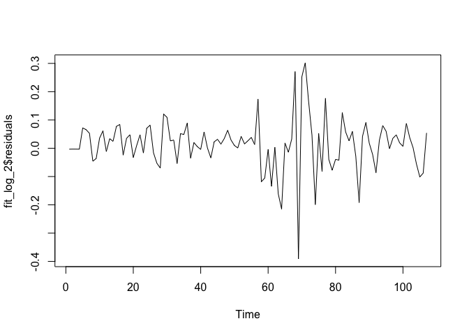

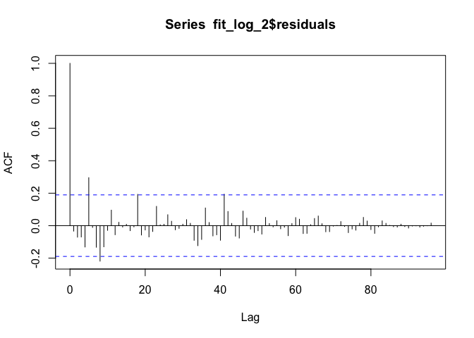

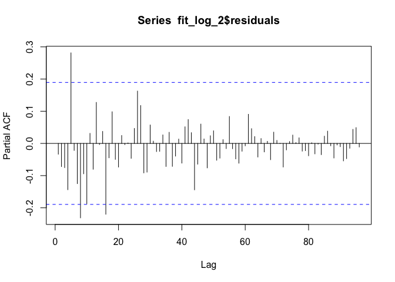

``` r
Box.test(fit_log_2$residuals,lag=16)
```

    ## 
    ##  Box-Pierce test
    ## 
    ## data:  fit_log_2$residuals
    ## X-squared = 22.777, df = 16, p-value = 0.1198

While the null-hypothesis of no autocorrelation in the data is not rejected by the Box-Pierce test, the fifth lag still is out of limits, and so is the eigth. Thus, we proceed by including 5 AR terms in the non-seasonal part, and 2 in the seasonal part, and will compare the prediction performance of the several estimated models.

``` r
fit_log_3 <- arima(z,order=c(5,0,0),seasonal=list(order=c(1,1,0),period=s)) 
fit_log_3
```

    ## 
    ## Call:
    ## arima(x = z, order = c(5, 0, 0), seasonal = list(order = c(1, 1, 0), period = s))
    ## 
    ## Coefficients:
    ##          ar1     ar2     ar3      ar4     ar5     sar1
    ##       0.5663  0.2388  0.0832  -0.3785  0.3962  -0.1185
    ## s.e.  0.0895  0.0992  0.1027   0.1265  0.1068   0.1388
    ## 
    ## sigma^2 estimated as 0.00792:  log likelihood = 101.8,  aic = -189.6

``` r
plot(fit_log_3$residuals)
```


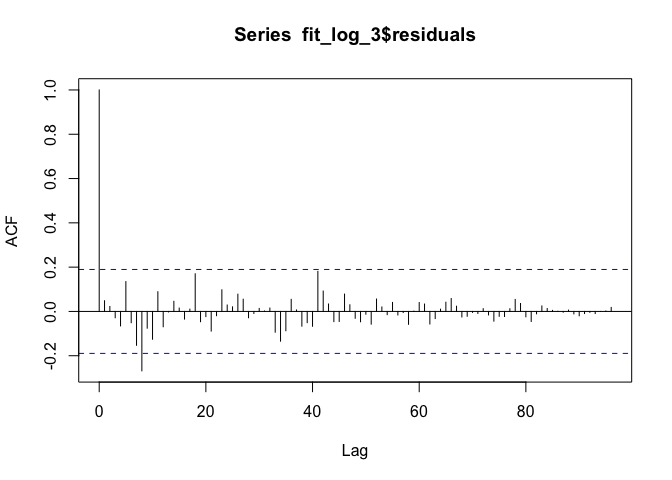 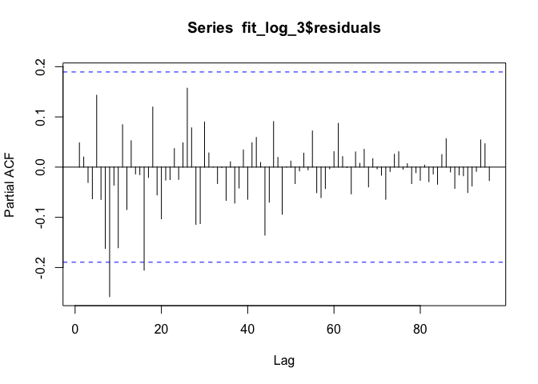

``` r
Box.test(fit_log_3$residuals,lag=16)
```

    ## 
    ##  Box-Pierce test
    ## 
    ## data:  fit_log_3$residuals
    ## X-squared = 17.294, df = 16, p-value = 0.3668

The eigth lag in the PACF stil being out of limits suggests that a second AR term in the seasonal part might be appropriate.

``` r
fit_log_4 <- arima(z,order=c(5,0,0),seasonal=list(order=c(2,1,0),period=s)) 
fit_log_4
```

    ## 
    ## Call:
    ## arima(x = z, order = c(5, 0, 0), seasonal = list(order = c(2, 1, 0), period = s))
    ## 
    ## Coefficients:
    ##          ar1     ar2     ar3      ar4     ar5     sar1     sar2
    ##       0.5391  0.2235  0.1870  -0.4995  0.4936  -0.0570  -0.3479
    ## s.e.  0.0868  0.0881  0.0906   0.0991  0.0993   0.1154   0.0982
    ## 
    ## sigma^2 estimated as 0.007096:  log likelihood = 106.99,  aic = -197.97

``` r
plot(fit_log_4$residuals)
```

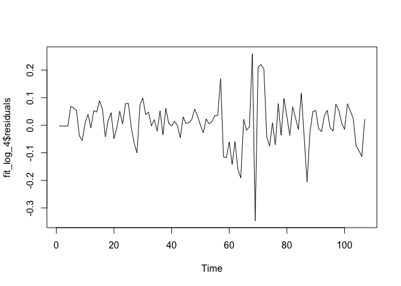

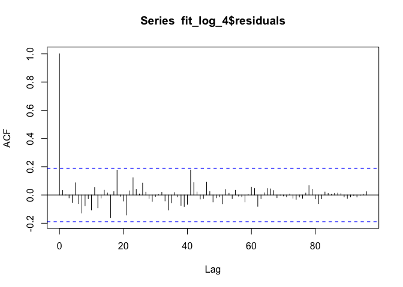 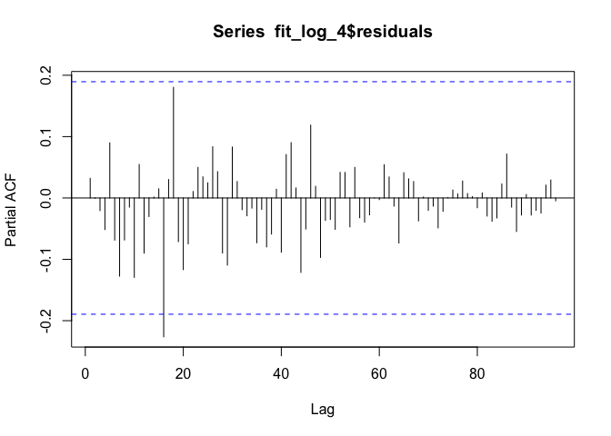

``` r
Box.test(fit_log_4$residuals,lag=16)
```

    ## 
    ##  Box-Pierce test
    ## 
    ## data:  fit_log_4$residuals
    ## X-squared = 9.4837, df = 16, p-value = 0.8922

While this last model captures the data well, the SAR(1) coefficient has been insignificant throughout all models. Therefore, we will fit two more models, one SARIMA(5,0,0)x(0,1,0), and one SARIMA(8,0,0)x(0,1,0) in order to capture the eigth lag.

``` r
fit_log_5 <- arima(z,order=c(5,0,0),seasonal=list(order=c(0,1,0),period=s)) 
fit_log_5
```

    ## 
    ## Call:
    ## arima(x = z, order = c(5, 0, 0), seasonal = list(order = c(0, 1, 0), period = s))
    ## 
    ## Coefficients:
    ##          ar1     ar2     ar3      ar4     ar5
    ##       0.5615  0.2335  0.0943  -0.4400  0.4390
    ## s.e.  0.0872  0.0944  0.0963   0.0925  0.0882
    ## 
    ## sigma^2 estimated as 0.007989:  log likelihood = 101.41,  aic = -190.82

``` r
plot(fit_log_5$residuals)
```

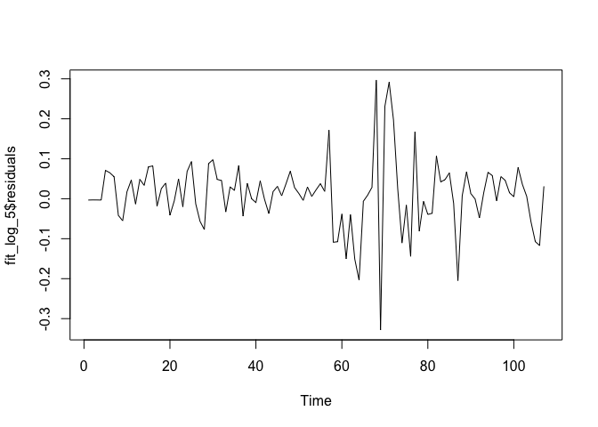

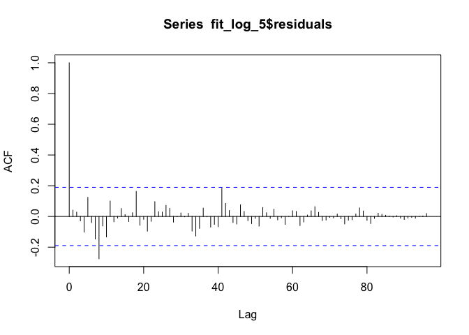 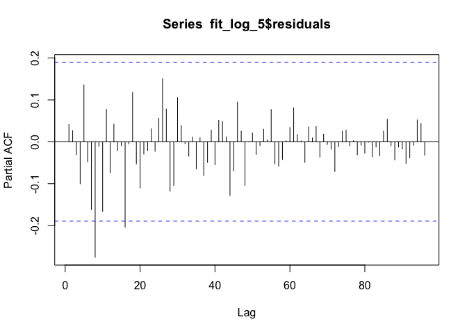

``` r
Box.test(fit_log_5$residuals,lag=16)
```

    ## 
    ##  Box-Pierce test
    ## 
    ## data:  fit_log_5$residuals
    ## X-squared = 17.676, df = 16, p-value = 0.3432

``` r
fit_log_6 <- arima(z,order=c(8,0,0),seasonal=list(order=c(0,1,0),period=s)) 
fit_log_6
```

    ## 
    ## Call:
    ## arima(x = z, order = c(8, 0, 0), seasonal = list(order = c(0, 1, 0), period = s))
    ## 
    ## Coefficients:
    ##          ar1     ar2     ar3      ar4     ar5      ar6      ar7      ar8
    ##       0.5943  0.2570  0.0520  -0.3939  0.5363  -0.0285  -0.1445  -0.0150
    ## s.e.  0.0978  0.1148  0.1176   0.1029  0.1024   0.1161   0.1126   0.0985
    ## 
    ## sigma^2 estimated as 0.007665:  log likelihood = 103.41,  aic = -188.82

``` r
plot(fit_log_6$residuals)
```

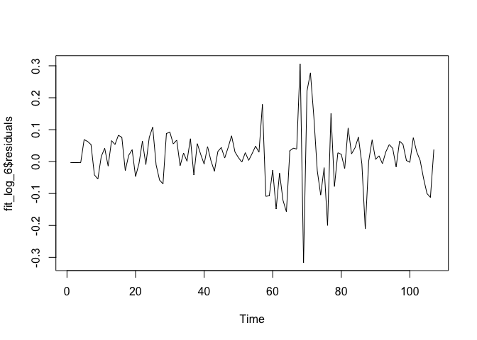

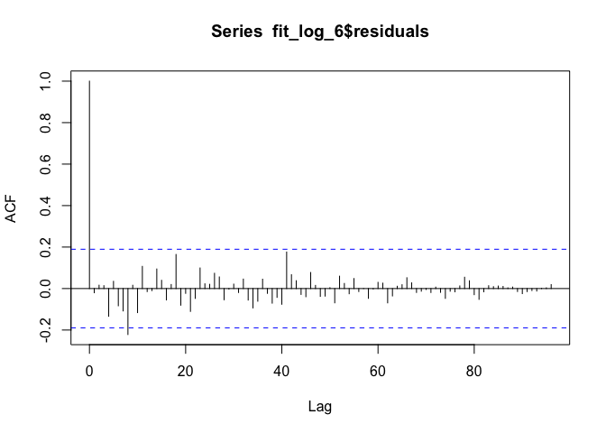 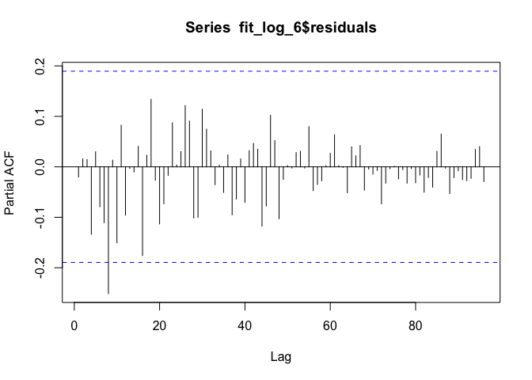

``` r
Box.test(fit_log_6$residuals,lag=16)
```

    ## 
    ##  Box-Pierce test
    ## 
    ## data:  fit_log_6$residuals
    ## X-squared = 13.554, df = 16, p-value = 0.6319

Some further iterations were attempted, including moving average terms, which all yielded worse models though. fit\_log\_4 not only, as we will see, performs well in prediction, but also has all-significant coefficients (aparrt from the SAR(1) coefficient), unlike models including higher lags.

### Estimation Error

``` r
length(y)
```

    ## [1] 107

For the original scale data:

For the logarithmised data:

### Overview of models:

    ## [1] "SARIMA(1,0,0)x(1,1,0), MAPE 4 steps ahead"

    ##          [,1]     [,2]     [,3]     [,4]
    ## [1,] 5.420731 7.769715 8.950393 9.787136

    ## [1] "SARIMA(2,0,0)x(1,1,0), MAPE 4 steps ahead"

    ##          [,1]     [,2]     [,3]     [,4]
    ## [1,] 4.812804 6.610414 8.452557 8.706129

    ## [1] "SARIMA(5,0,0)x(1,1,0), MAPE 4 steps ahead"

    ##          [,1]     [,2]     [,3]     [,4]
    ## [1,] 4.587221 6.290561 7.818287 7.984513

    ## [1] "SARIMA(5,0,0)x(2,1,0), MAPE 4 steps ahead"

    ##         [,1]     [,2]     [,3]     [,4]
    ## [1,] 4.59289 6.051818 6.579528 7.143772

    ## [1] "SARIMA(5,0,0)x(0,1,0), MAPE 4 steps ahead"

    ##          [,1]     [,2]    [,3]    [,4]
    ## [1,] 4.454854 6.237567 7.74364 7.95353

    ## [1] "SARIMA(8,0,0)x(0,1,0), MAPE 4 steps ahead"

    ##          [,1]    [,2]     [,3]     [,4]
    ## [1,] 4.226765 5.68076 7.512975 8.394921

Conclusion
----------

Taking the logarithm of the time series lead to considerably lower prediction errors. Of the models fit on the logarithmised data, a SARIMA(5,0,0)x(1,1,0) model seems to capture the data well. Adding a SAR(2) term improves the 4 steps ahead prediction accuracy, but slightly worsens the one step ahead prediction. When all SAR terms are removed, the model does indeed improve, at least in the shorter term. Increasing the number of AR terms to 8 slightly improves the 1 step ahead prediction, but considerably worsens the further ahead ones.

Due to its simplicity together with good predictions, significant coefficients and white noise residuals, the SARIMA(5,0,0)x(0,1,0) model is chosen. It did not yield the best prediction of all models, in fact prediction errors further decrease when adding more AR terms, but given the size of the dataset, it is unclear how reliable these small differences in prediction error are.

Below, the model's prediction for four years ahead using the chosen model is plotted.

``` r
fit_log_4 <- arima(z[1:106],order=c(5,0,0),seasonal=list(order=c(2,1,0),period=s))

y.pred<-predict(fit_log_4, n.ahead=19)

ts.plot(y, xlim = c(90, 130), ylim = c(0, 1.6))
lines(exp(y.pred$pred), col="red")
lines(exp(y.pred$pred+1.96*y.pred$se), col="red",lty=3)
lines(exp(y.pred$pred-1.96*y.pred$se), col="red",lty=3)
```

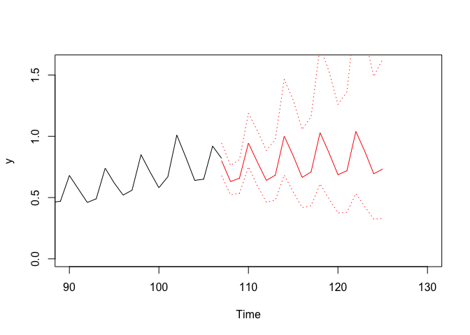
